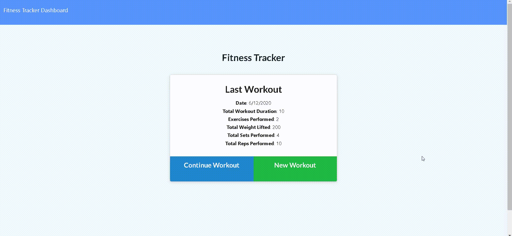

# Workout-Tracker


## Description 

This application allows the user to view and track daily workouts. As a user, you will be able to log multiple exercises in a workout on a given day. As a user, you will be able to track the name, type, weight, sets, reps, and duration of the exercise. This application can be used to track both resistance and cardio type exercises.

## Gif of Working Application



## Link to Working Application


## Table of Contents
* [Installation](#installation)
* [Intructions](#instructions)
* [License](#license)
* [Dependencies](#dependencies)
* [Tests](#questions)

## Installation

Clone the repository locally by entering into your terminal 'git clone "git@github.com:jlbuster/Workout-Tracker.git"'. Next, make sure to install express, mongoose, and morgan as dependencies in the package.json file. You're good to go!

## Instructions

Start off by running...
```javascript
npm start
```
... in your terminal in the root folder. Now the application is up and running! 

At the homescreen, the user will have the option to either continue a workout or create a new workout. Clicking either one of these will give the user the option to describe the workout that has been completed or will be continued. After inputing all the necessary information and clicking either 'complete', or 'add exercise', the user will notice a prompt to the top right of their screen indicating that the exercise has been completed or continued.

In order to view all the stats of the user's workouts from the past 7 days, the user can click Dashboard in the top left corner. This will bring up all the user's workout stats from the past 7 days.

## License

This project uses the MIT license. To learn more about this license, simply search the license through google.

## Dependecies

Uses expresss, mongoose, and morgan

## Tests

This application includes no test
